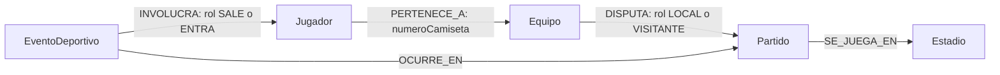

# Modelo de grafo del Fixture 2030

El subgrafo responde quién pertenece a cada selección, contra quién juega, dónde está programado cada encuentro y qué personas intervienen en una incidencia de ese partido. Representa relaciones del torneo y una muestra de programación; no reemplaza las fichas documentales ni almacena estadísticas acumuladas.

## Diagrama

Las flechas indican la dirección almacenada. Cypher puede recorrerlas en sentido inverso; no se duplican relaciones inversas. El análisis de encuentros trata `DISPUTA` como no dirigida para poder pasar de un equipo a su rival.

## Etiquetas y propiedades

Cada nodo de la muestra tiene **una sola etiqueta**, `origen: 'sintetico-grupo13-v1'` y `esDatoSintetico: true`. Las propiedades siguientes son obligatorias en la carga; su presencia se comprueba por Cypher. No se usan identificadores internos de Neo4j como identidad de negocio.

| Etiqueta | Propiedades específicas y tipos | Identificador y ejemplo | Cantidad |
|---|---|---|---:|
| `Equipo` | `equipoId`, `codigo`, `nombre`, `confederacion`: String | `EQ-001` a `EQ-064`; códigos `F01` a `F64` | 64 |
| `Jugador` | `jugadorId`, `nombre`, `apellido`, `posicion`: String | `JUG-0001` a `JUG-1536` | 1.536 |
| `Partido` | `partidoId`, `grupo`, `fase`, `estado`: String; `jornada`: Integer; `inicio`: DateTime con UTC | `PAR-001` a `PAR-064` | 64 |
| `Estadio` | `estadioId`, `nombre`, `ciudad`: String | `EST-01` a `EST-08` | 8 |
| `EventoDeportivo` | `eventoId`, `tipo`: String; `minuto`: Integer | `EVT-PAR-001-LOCAL`, `EVT-PAR-001-VISITANTE`, etc. | 128 |

Dominios: confederaciones AFC, CAF, CONCACAF, CONMEBOL, OFC y UEFA; posiciones ARQUERO, DEFENSOR, MEDIOCAMPISTA y DELANTERO. En esta muestra los partidos tienen `fase=GRUPOS_MUESTRA`, `estado=FINALIZADO`, jornadas 1 y 2 y grupos G01 a G16. Los eventos tienen `tipo=SUSTITUCION`; minuto 60 para el equipo local y 65 para el visitante. Son hechos ficticios de una simulación del torneo de 2030, no resultados oficiales ni datos observados en 2026.

## Relaciones, propiedades y cardinalidades

| Patrón dirigido | Propiedades | Regla de dominio del módulo | Cardinalidad en la muestra | Cantidad |
|---|---|---|---|---:|
| `Jugador → PERTENECE_A → Equipo` | `numeroCamiseta`: Integer 1–24 | Cada jugador pertenece a un equipo actual; cada equipo tiene un plantel | 1 equipo por jugador, 24 jugadores por equipo | 1.536 |
| `Equipo → DISPUTA → Partido` | `rol`: String, LOCAL o VISITANTE | Dos equipos distintos por partido; un rol de cada clase; equipo con 0..N encuentros | 2 partidos por equipo, 2 equipos por partido | 128 |
| `Partido → SE_JUEGA_EN → Estadio` | Ninguna | Un estadio por partido; estadio con 0..N partidos | 1 estadio por partido, 8 partidos por estadio | 64 |
| `EventoDeportivo → OCURRE_EN → Partido` | Ninguna | Una incidencia pertenece a un partido; partido con 0..N incidencias | 2 incidencias por partido | 128 |
| `EventoDeportivo → INVOLUCRA → Jugador` | `rol`: String, SALE o ENTRA | Una sustitución involucra dos jugadores diferentes del mismo equipo participante | 2 jugadores por evento; cada uno puede figurar en 0..N eventos | 256 |

Total: **1.800 nodos y 2.112 relaciones**. Los roles LOCAL/VISITANTE son administrativos; no afirman ventaja de localía. No se crea `JUGO_EN`: pertenecer al plantel de un equipo que disputa un partido no demuestra que el jugador ingresó a la cancha. `INVOLUCRA` expresa únicamente la intervención registrada por la incidencia.

## Identidad y continuidad documental

Para el jugador de número global `n` (1..1536), el equipo es `EQ-` seguido de `floor((n-1)/24)+1`, con tres dígitos, y la camiseta es `(n-1)%24+1`. El grafo conserva `equipoId`, `jugadorId`, códigos, nombres, apellidos, posiciones y pertenencia de los datos de prueba del Hito 4.

`jugadores.equipoId` se representa mediante el extremo de `PERTENECE_A`. `numeroCamiseta` se guarda en esa relación porque corresponde al plantel de la selección. No se conserva además un array de jugadores en el equipo ni un segundo campo de referencia en el jugador. El `_id` documental es derivable (`equipo:` + equipoId; `jugador:` + jugadorId) y no se duplica.

## Restricciones e integridad

`01_constraints.cypher` instala seis restricciones de unicidad: `uq_equipo_id`, `uq_equipo_codigo`, `uq_jugador_id`, `uq_partido_id`, `uq_estadio_id`, `uq_evento_id`. Cada una tiene su índice de respaldo. También crea `idx_partido_inicio` para el rango temporal de Q09, inspeccionado mediante P01. Los índices LOOKUP de etiquetas/tipos provienen de Neo4j.

Las restricciones de unicidad no exigen que la propiedad exista ni controlan la cantidad de relaciones. `06_verify.cypher` comprueba las propiedades requeridas, identidades, planteles, camisetas, roles, extremos, duplicados, participantes y programación. Los 44 controles deben devolver `TRUE`.

## Política de duplicación y carga

La carga hace `MERGE` de nodos por el identificador único y `MERGE` de relaciones por extremos y tipo; las propiedades se asignan después con `SET`. Se ejecuta de forma serial y en una única transacción explícita de `cypher-shell`. No usa aleatoriedad, reloj de ejecución, incrementos ni eliminaciones.

Repetir la carga sobre el ambiente preparado conserva nodos, relaciones y propiedades, sin duplicados. La recarga restablece los valores definidos, pero no elimina datos agregados por fuera de ella. Las consultas de integridad permiten detectar diferencias con la muestra esperada.

## Recorridos y valor del grafo

- Q02: equipo → partido → estadio, para listar selecciones que pasan por una sede sin duplicarlas por jornada.
- Q04: equipo → partido ← rival, para recuperar rivales sin mantener una lista redundante de enfrentamientos.
- Q07: partido ← evento → jugador → equipo → partido, para contextualizar la incidencia y comprobar que el plantel pertenece al encuentro.
- Q08: jugador → equipo → partido → estadio, para navegar la programación desde la identidad del jugador.
- A01: camino alternante de equipos y partidos para encontrar una conexión indirecta entre selecciones.

Un partido vincula equipos que vuelven a aparecer en otros encuentros y sedes; una incidencia conecta un partido con personas identificables. Las relaciones explícitas permiten expresar esos recorridos sin embeber ni sincronizar copias de planteles, rivales, estadios o incidencias dentro de cada ficha.
