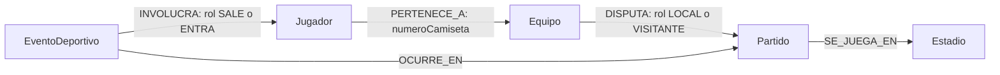

# Modelo de grafo del Fixture 2030

El grafo permite consultar a qué equipo pertenece un jugador, contra quién juega cada equipo, dónde se disputa un partido y quién interviene en una incidencia. Para resolver estas preguntas conectamos equipos, jugadores, partidos, estadios y eventos mediante relaciones.

## Diagrama

Las flechas indican la dirección de cada relación. Cypher también permite recorrerlas en sentido inverso, por lo que no necesitamos guardar una segunda relación para volver al nodo de origen.

## Etiquetas y propiedades principales

Cada nodo tiene una etiqueta y las propiedades `origen: 'sintetico-grupo13-v1'` y `esDatoSintetico: true`.

| Etiqueta | Propiedades y tipos | Identificadores | Cantidad |
|---|---|---|---:|
| `Equipo` | `equipoId`, `codigo`, `nombre`, `confederacion`: texto | `EQ-001` a `EQ-064`, códigos `F01` a `F64` | 64 |
| `Jugador` | `jugadorId`, `nombre`, `apellido`, `posicion`: texto | `JUG-0001` a `JUG-1536` | 1.536 |
| `Partido` | `partidoId`, `grupo`, `fase`, `estado`: texto. `jornada`: entero. `inicio`: DateTime en UTC | `PAR-001` a `PAR-064` | 64 |
| `Estadio` | `estadioId`, `nombre`, `ciudad`: texto | `EST-01` a `EST-08` | 8 |
| `EventoDeportivo` | `eventoId`, `tipo`: texto. `minuto`: entero | `EVT-PAR-001-LOCAL`, `EVT-PAR-001-VISITANTE`, entre otros | 128 |

Las confederaciones son AFC, CAF, CONCACAF, CONMEBOL, OFC y UEFA. Las posiciones son ARQUERO, DEFENSOR, MEDIOCAMPISTA y DELANTERO. Los partidos pertenecen a los grupos G01 a G16, con jornadas 1 y 2, `fase=GRUPOS_MUESTRA` y `estado=FINALIZADO`. Los eventos son de tipo `SUSTITUCION`, en el minuto 60 para el equipo local y 65 para el visitante.

## Relaciones, dirección y cardinalidad

| Relación dirigida | Propiedades | Cardinalidad del modelo | Cantidad en la muestra |
|---|---|---|---:|
| `Jugador → PERTENECE_A → Equipo` | `numeroCamiseta`: entero de 1 a 24 | Un equipo por jugador y varios jugadores por equipo. La muestra tiene 24 jugadores por equipo | 1.536 |
| `Equipo → DISPUTA → Partido` | `rol`: LOCAL o VISITANTE | Un equipo puede disputar 0..N partidos. Cada partido tiene dos equipos distintos, uno por rol. La muestra tiene dos partidos por equipo | 128 |
| `Partido → SE_JUEGA_EN → Estadio` | Ninguna | Un estadio por partido y 0..N partidos por estadio. La muestra tiene ocho partidos por estadio | 64 |
| `EventoDeportivo → OCURRE_EN → Partido` | Ninguna | Un partido por evento y 0..N eventos por partido. La muestra tiene dos eventos por partido | 128 |
| `EventoDeportivo → INVOLUCRA → Jugador` | `rol`: SALE o ENTRA | Dos jugadores distintos del mismo equipo participante por sustitución, uno por rol. Cada jugador puede figurar en 0..N eventos | 256 |

El total es de **1.800 nodos y 2.112 relaciones**. LOCAL y VISITANTE distinguen los roles del encuentro. La pertenencia al plantel no demuestra que un jugador haya ingresado a la cancha, por eso `INVOLUCRA` registra su participación en una incidencia concreta.

## Relación con los identificadores del Hito 4

Conservamos `equipoId`, `jugadorId`, códigos, nombres, apellidos, posiciones y pertenencia de los datos de prueba del Hito 4. Por ejemplo, `EQ-001` reúne a `JUG-0001` a `JUG-0024`. Estos identificadores permiten reconocer las mismas entidades en ambos hitos sin depender de los identificadores internos de Neo4j.

La referencia `jugadores.equipoId` pasa a representarse con `PERTENECE_A`. La propiedad `numeroCamiseta` queda en esa relación porque corresponde al jugador dentro de su plantel. No repetimos una lista de jugadores en cada equipo ni el `_id` documental.

## Restricciones e índice temporal

[01_constraints.cypher](../queries/01_constraints.cypher) define seis restricciones de unicidad:

- `uq_equipo_id` y `uq_equipo_codigo`, para el identificador y el código de equipo.
- `uq_jugador_id`, `uq_partido_id`, `uq_estadio_id` y `uq_evento_id`, para los demás identificadores.

También crea `idx_partido_inicio` sobre `Partido.inicio`, utilizado en el filtro por fechas de Q09. Las restricciones de unicidad no controlan la presencia de propiedades ni la cardinalidad de las relaciones. Esas condiciones se revisan con [06_verify.cypher](../queries/06_verify.cypher).

## Cómo evitamos duplicados

La [carga](../queries/02_load.cypher) usa `MERGE` para buscar o crear nodos por su identificador y relaciones por su tipo y extremos. Después asigna sus propiedades con `SET`. Así se mantiene la idempotencia: repetir la carga conserva la muestra sin agregar duplicados. La recarga restablece los valores definidos, pero no elimina datos añadidos por fuera de ella.

## Ejemplos de recorridos

- Q02 recorre equipo → partido → estadio para listar las selecciones que juegan en una sede.
- Q04 recorre equipo → partido ← rival para obtener los rivales de un equipo.
- Q07 conecta partido, evento, jugador y equipo para consultar las incidencias y sus participantes.
- Q08 recorre jugador → equipo → partido → estadio para consultar la programación desde un jugador.
- A01 busca un camino mínimo entre equipos a través de sus partidos, recorriendo `DISPUTA` en ambos sentidos.
