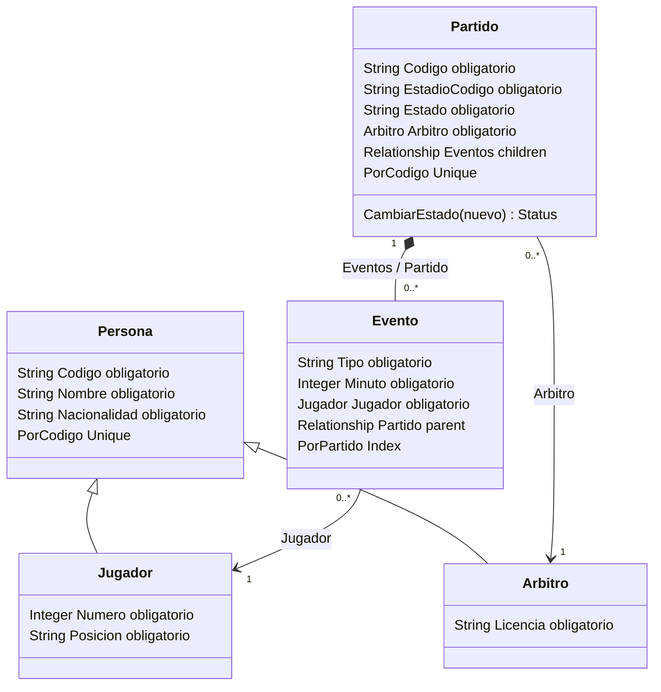

[Repositorio Fixture 2030 - Grupo 13](https://github.com/AxelYairFischbein/Fixture2030-Grupo13)

# Hito 9 - Entidades complejas con InterSystems IRIS

El módulo representa personas y un partido con eventos dependientes. Utiliza objetos persistentes, herencia, una relación bidireccional y una operación de dominio que controla las transiciones de estado. La proyección SQL permite consultar los mismos objetos desde tablas.

El alcance comprende cinco clases de dominio, una demostración pequeña y un único servicio IRIS. No hay conexiones ejecutables con otros hitos. Se reutilizan `PAR-001`, `EST-01` y `JUG-0001`, con los atributos sintéticos del jugador del proyecto. `ARB-001` y su licencia son datos sintéticos de esta muestra.

## Preparación en Windows

Se necesitan PowerShell, Docker Desktop con contenedores Linux, Docker Compose y los puertos 1972 y 52773 libres. ObjectScript se ejecuta dentro de IRIS, sin instalar Python ni un cliente externo.

Desde la raíz del repositorio:

```powershell
Set-Location '.\Hito 9'
docker info
docker ps -a --format 'table {{.Names}}\t{{.Image}}\t{{.Ports}}'
if (-not $env:USERPROFILE) { throw 'Falta la variable USERPROFILE' }
$rutaH9 = Join-Path $env:USERPROFILE 'docker\data\iris'
Test-Path -LiteralPath $rutaH9
```

Antes de iniciar, comprobar si otra instancia usa estos puertos o la carpeta durable. Si existe una instancia o datos cuyo origen no está identificado, detener la preparación y revisar su pertenencia. No iniciar dos motores sobre la misma carpeta ni borrar datos para liberar el entorno.

Una vez comprobado que la carpeta corresponde a este módulo, crearla si todavía no existe:

```powershell
New-Item -ItemType Directory -Force -Path $rutaH9 | Out-Null
docker compose config --quiet
docker compose up -d iris
docker compose ps
```

Detener la secuencia si un comando falla. Esperar a que el servicio indique `healthy`. Para diagnosticar el inicio, consultar `docker compose logs --tail 30 iris` sin copiar información sensible a la evidencia. Un contenedor en `running` no garantiza que el motor IRIS haya completado su inicio.

El Compose utiliza `intersystems/iris-community:latest-cd`. Publica los puertos solamente en `127.0.0.1`, monta los scripts como solo lectura y establece `ISC_DATA_DIRECTORY=/durable`. El bind mount une `$env:USERPROFILE\docker\data\iris` con `/durable`. Compose sustituye `${USERPROFILE}` desde el entorno del proceso. La expresión de PowerShell para leer esa variable es `$env:USERPROFILE`.

Comprobar el montaje, la configuración durable y el acceso del usuario del contenedor:

```powershell
$contenedorH9 = docker compose ps -q iris
docker inspect $contenedorH9 --format '{{json .Mounts}}'
docker compose exec -T iris id
docker compose exec -T iris stat -c '%u:%g %a %n' /durable
docker compose exec -T iris test -w /durable
if ($LASTEXITCODE -ne 0) { throw 'El usuario de IRIS no puede escribir en /durable' }
docker compose exec -T iris printenv ISC_DATA_DIRECTORY
```

El montaje de datos debe tener `Type: bind`, origen bajo la carpeta personal y destino `/durable`. El montaje de `/scripts` debe tener `RW: false`. Docker Desktop puede representar el origen como ruta Windows o mediante `/run/desktop/mnt/host/`.

La comprobación de escritura se ejecuta como el usuario habitual del contenedor, `irisowner`, con UID y GID 51773. El arranque requiere también la propiedad correcta del directorio. En la ejecución registrada, Docker presentó inicialmente la carpeta nueva como propiedad de `root`. Aunque `test -w` pasó, IRIS rechazó inicializarla con `Error executing chown irisowner:irisowner /durable/`.

Si aparece ese mismo error y ya se comprobó que `/durable` corresponde exclusivamente a la carpeta de este módulo, ajustar solo su propietario desde PowerShell:

```powershell
docker compose exec -T --user root iris chown 51773:51773 /durable
if ($LASTEXITCODE -ne 0) { throw 'No se pudo ajustar el propietario de /durable' }
docker compose restart iris
docker compose ps
docker compose exec -T iris stat -c '%u:%g %a %n' /durable
```

`chown` se ejecuta dentro del contenedor y no recorre subdirectorios. El servicio continúa ejecutándose como `irisowner`. En esta prueba, IRIS terminó de inicializar el directorio con propietario `51773:51773` y modo `700`. No se aplicó `chmod` ni se cambiaron permisos de carpetas ajenas. Si el problema persiste, revisar el acceso a `$rutaH9` y su disponibilidad para Docker Desktop sin borrar los datos.

El Terminal se abre desde el contenedor local. Si la instancia solicita autenticación o un cambio de contraseña, usar sus credenciales locales de manera interactiva. No guardarlas en Compose, comandos registrados o capturas. `.gitignore` excluye configuración local y secretos. Las bases, journals y archivos de IRIS permanecen fuera del repositorio, en el directorio durable.

## Modelo y reglas de integridad

Las clases pertenecen al paquete `FixtureH9` dentro del namespace `USER`. El paquete distingue este módulo de otras definiciones. Los IDs asignados por IRIS identifican los objetos y no reemplazan los códigos del Fixture. El ID de un evento depende del padre y no se supone numérico ni igual a su posición de inserción.

En el diagrama, `obligatorio` representa `[ Required ]`. Las subclases heredan los campos de Persona. La relación `parent` exige un padre y mantiene la inversa.



`Partido.Eventos` y `Evento.Partido` son los dos extremos de una relación formal con `Cardinality` e `Inverse`. Las referencias a Jugador y Arbitro son unidireccionales y no comparten la dependencia de ciclo de vida de los eventos.

| Regla | Lugar de aplicación | Resultado esperado |
| --- | --- | --- |
| Datos obligatorios y valores permitidos | Propiedades `[ Required ]`, rangos y `VALUELIST` en las clases | `%Save()` rechaza un hijo sin `Tipo` |
| Número entre 1 y 26 y minuto entre 0 y 130 | Parámetros de `%Integer` | Rechazo de valores fuera del rango |
| Códigos únicos de personas y partidos | Índices `PorCodigo` | No se pueden persistir dos objetos con el mismo código en la misma extensión |
| Evento dependiente de un único partido | Relación `parent/children` con inversas | Navegación en ambos sentidos y padre obligatorio |
| Guardado completo del árbol | Un `%Save()` del padre | Si un hijo es inválido, no se persisten el padre ni los hijos nuevos |
| Avance de estado | `Partido.CambiarEstado()` | Solo `PENDIENTE -> EN_JUEGO -> FINALIZADO` |
| No reabrir un partido finalizado | `Partido.CambiarEstado()` | Devuelve error y conserva `FINALIZADO` |
| Borrado de Partido | Dependencia padre–hijo de IRIS | Se eliminan sus eventos, conservando las personas independientes |

`Evento.PorPartido` indexa explícitamente la propiedad relacional usada al recuperar la colección. Los índices únicos de códigos permiten localizar la muestra y evitar duplicados. No se agregan índices sin una consulta o restricción concreta.

La transición se debe escribir mediante `CambiarEstado()`, que valida y guarda. Asignar `Estado` directamente o ejecutar un `UPDATE` SQL puede eludir esa regla. La demo usa SQL para lectura y no implementa una protección universal de transiciones frente a escrituras SQL. Los datos iniciales se asignan antes de guardar el árbol. No se necesita un callback adicional para duplicar las restricciones declarativas.

## Importar, compilar y ejecutar

Desde PowerShell, abrir el Terminal IRIS en el namespace indicado:

```powershell
docker compose exec iris iris session IRIS -U USER
```

Los siguientes comandos son **ObjectScript dentro del Terminal IRIS**, no comandos de PowerShell:

```objectscript
Write $Namespace, !, $ZVersion, !
Set sc = $System.OBJ.LoadDir("/scripts", "ck", .errores)
If $System.Status.IsError(sc) { Do $System.Status.DisplayError(sc) }
If $System.Status.IsOK(sc) { Write "COMPILACION OK", ! }
```

La importación debe compilar las seis clases sin errores. Si falla, no ejecutar la demo hasta resolver el error mostrado. Al repetir una importación se actualizan las definiciones del paquete, por lo que debe comprobarse primero que sean las de este módulo.

```objectscript
Set sc = ##class(FixtureH9.Demo).Ejecutar()
If $System.Status.IsError(sc) { Do $System.Status.DisplayError(sc) }
```

La demo realiza este recorrido:

1. Crea un Jugador, un Arbitro y un Partido con dos Eventos. Guarda el árbol con un solo `%Save()` del padre. No guarda individualmente los hijos.
2. Recupera el Partido por `%OpenId()` y navega `Eventos.GetNext(.clave)` y `evento.Partido`. Comprueba la herencia de las dos personas. No presupone la clave ni el orden de los hijos.
3. Ejecuta `SELECT` sobre `FixtureH9.Partido`, `FixtureH9.Evento` y `FixtureH9.Persona`. Contrasta IDs, relaciones y atributos con los objetos navegados.
4. Intenta guardar `H9-INVALIDO` con un hijo válido y otro sin `Tipo`. Comprueba que no existe el padre nuevo y que el recuento de eventos del jugador no aumentó.
5. Crea `H9-TEMPORAL`, aplica las dos transiciones válidas y rechaza volver de finalizado a en juego. Comprueba el estado conservado con SQL.
6. Borra solamente ese árbol temporal y verifica por identidad que sus dos hijos también desaparecieron. Conserva el partido principal y ambas personas.

El resultado completo esperado termina en `DEMO OK`. Los errores deliberados se identifican como `RECHAZO ESPERADO`. Cualquier otro error interrumpe la demo y debe revisarse. Los `%Status` de guardado, apertura, inserción en la relación y borrado se comprueban antes de continuar.

Repetir `Ejecutar()` detecta `PAR-001` y evita cargar otra muestra. Vuelve a verificarla y ejecuta las pruebas con árboles temporales. Si quedó un árbol de prueba de una ejecución interrumpida, se informa el conflicto y no se lo borra automáticamente.

Para salir del Terminal:

```objectscript
Halt
```

## Persistencia y detención

Durable `%SYS` conserva datos, clases compiladas y configuración en `/durable`. Para comprobarlo, ejecutar primero la verificación de solo lectura en el Terminal:

```objectscript
Set sc = ##class(FixtureH9.Demo).Verificar()
If $System.Status.IsError(sc) { Do $System.Status.DisplayError(sc) }
Halt
```

Luego, en PowerShell:

```powershell
docker compose up -d --force-recreate iris
docker compose ps
$contenedorH9 = docker compose ps -q iris
docker inspect $contenedorH9 --format '{{json .Mounts}}'
docker compose exec iris iris session IRIS -U USER
```

Esperar a que el servicio esté disponible antes de abrir el Terminal. Ejecutar nuevamente **solo** `FixtureH9.Demo.Verificar()` y comparar los IDs, atributos y recuentos. No importar clases ni ejecutar `Ejecutar()` entre las dos verificaciones. Así se comprueba que la recuperación proviene del directorio durable.

Para detener e iniciar conservando datos, desde PowerShell:

```powershell
docker compose stop iris
docker compose start iris
docker compose ps
```

## Evidencia y límites

La validación se ejecutó el **9 de octubre de 2026**, entre las 10:42 y las 10:45 de Argentina, correspondientes a las 13:42–13:45 UTC. Se utilizó Docker 29.7.2 e **IRIS 2026.2, Build 221U**, con la imagen `intersystems/iris-community:latest-cd` y namespace `USER`.

Las seis clases compilaron sin errores. La demo y su repetición finalizaron correctamente. Se comprobaron herencia, guardado conjunto, navegación en ambos sentidos y coincidencia con SQL. El hijo sin `Tipo` fue rechazado y no se guardaron parcialmente el padre ni sus hijos. Las transiciones válidas se persistieron, se rechazó reabrir el partido finalizado y se verificó el borrado de los dos eventos del árbol temporal.

La recreación del contenedor conservó las clases compiladas y la muestra, sin importar ni cargar entre las verificaciones. Los IDs anteriores y posteriores coincidieron: Partido `1`, Eventos `1||1` y `1||2`, Arbitro `1` y Jugador `2`. Los recuentos finales fueron un Partido, dos Eventos y dos Personas, correspondientes a un Jugador y un Arbitro. No quedaron árboles temporales.

La [evidencia de ejecución](evidencia/ejecucion.txt) reúne el entorno observado, la compilación, una salida completa de la demo y extractos de la repetición y la persistencia. Distingue el ajuste inicial de propiedad de las pruebas funcionales posteriores. No se midió rendimiento.

Las capturas de [entorno y compilación](evidencia/01_entorno.png) e [integridad](evidencia/02_integridad.png) muestran dos ejecuciones posteriores del mismo día, a las 15:22:32 y 15:26:29 UTC respectivamente. La primera registra el servicio `healthy`, el namespace `USER`, la versión y `COMPILACION OK`. La segunda conserva los mismos IDs de la muestra y finaliza con `DEMO OK` y `STATUS_DEMO=1`. La prueba de persistencia está registrada en la evidencia de texto.

La muestra principal queda en `PENDIENTE`. Las transiciones y el borrado se prueban sobre el árbol temporal para que repetir la demo no altere el partido principal. Los rangos adicionales declarados no constituyen una batería de pruebas negativas. La demo es secuencial, sin usuarios concurrentes ni mediciones de rendimiento. No valida reglas completas de fútbol ni impide por sí sola cualquier escritura externa.

## Archivos y cobertura

| Archivo | Función |
| --- | --- |
| [docker-compose.yml](docker-compose.yml) | Servicio, puertos locales y Durable `%SYS` |
| [Persona](scripts/FixtureH9.Persona.cls) | Base persistente y código único |
| [Jugador](scripts/FixtureH9.Jugador.cls) | Especialización con número y posición |
| [Arbitro](scripts/FixtureH9.Arbitro.cls) | Especialización con licencia |
| [Partido](scripts/FixtureH9.Partido.cls) | Padre, relación y método de transición |
| [Evento](scripts/FixtureH9.Evento.cls) | Hijo, restricciones e índice relacional |
| [Demo](scripts/FixtureH9.Demo.cls) | Única demostración ejecutable y verificación de solo lectura |
| [.gitignore](.gitignore) | Exclusiones de archivos locales y sensibles |
| [Evidencia de ejecución](evidencia/ejecucion.txt) | Entorno, compilación, demo, repetición y persistencia verificadas |
| [Captura del entorno](evidencia/01_entorno.png) | Servicio saludable, versión y compilación de las seis clases |
| [Captura de integridad](evidencia/02_integridad.png) | Objetos y SQL, validaciones, atomicidad, transiciones y borrado |

RF1 y RNF1 corresponden al entorno. RF2–RF5 y RNF3 corresponden a las cinco clases. RF6–RF8 y RNF2 se verifican con compilación y demostración. RF9 corresponde a `CambiarEstado()`. RNF4 queda representado por los archivos `.cls`, el diagrama y las instrucciones del Terminal. RNF5 corresponde al repositorio del equipo enlazado al comienzo y a esta estructura navegable.
